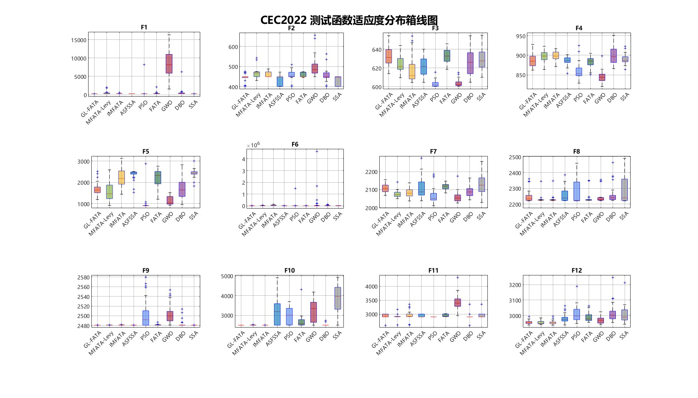

# GL-FATA: Improved Fata Morgana Algorithm for CEC2022 Optimization

[](https://www.mathworks.com/products/matlab.html)
[](LICENSE)
[](https://github.com/aliasgharheidaricom/FATA-An-Efficient-Optimization-Method-Based-on-Geophysics)

GL-FATA 是一个用于连续数值优化的 MATLAB 元启发式优化算法毕业设计项目（metaheuristic optimization / swarm intelligence）。在原始 **FATA（Fata Morgana Algorithm）** 的海市蜃楼滤波与光传播机制上，项目实现了 PWLCM 混沌初始化、引导因子折射和 Lévy 飞行扰动，并提供 IEEE CEC2022 基准测试、对比实验、消融实验与结果分析代码。

**Keywords:** Fata Morgana Algorithm, FATA, GL-FATA, metaheuristic optimization, swarm intelligence, MATLAB, CEC2022, continuous optimization, Lévy flight, chaotic initialization.

本仓库将论文作者维护的原始 FATA 作为 Git submodule 固定在 `third_party/FATA`。这样既可以在本地对照完整上游实现，又能明确区分本项目的改进代码与基线来源。

## 目录

- [快速开始](#快速开始)
- [算法与代码对应](#算法与代码对应)
- [CEC2022 实验复现](#cec2022-实验复现)
- [项目结构](#项目结构)
- [结果与可复现性说明](#结果与可复现性说明)
- [引用与许可证](#引用与许可证)

## 快速开始

### 1. 克隆并初始化上游基线

首次克隆请使用：

```bash
git clone --recurse-submodules https://github.com/424635328/GL-FATA.git
cd GL-FATA
```

已有工作副本则执行：

```bash
git submodule update --init --recursive
```

`third_party/FATA` 是固定提交的官方基线，而不是本项目修改后的实现。查看其固定版本：

```bash
git submodule status
```

### 2. 运行基础验证

在 MATLAB 中从仓库根目录运行：

```matlab
run(fullfile('tests', 'smoke_test.m'))
```

该测试在标量与逐维边界下分别运行 GL-FATA 与 FATA，并检查输出是否有限、收敛曲线是否生成、解是否满足边界。它不需要额外工具箱，也不运行耗时的 CEC2022 完整实验。

### 3. 最小调用示例

```matlab
addpath(pwd);
rng(20260722, 'twister');

fobj = @(x) sum(x .^ 2);
lb = -100;
ub = 100;
dim = 30;
populationSize = 30;
maxFEs = 15000;

[bestPos, bestScore, curve] = GL_FATA( ...
    fobj, lb, ub, dim, populationSize, maxFEs);

semilogy(curve, 'LineWidth', 1.5);
xlabel('Iteration');
ylabel('Best fitness');
title('GL-FATA convergence on Sphere');
grid on;
```

根目录的 `FATA.m` 是可直接运行的基线副本；`initialization.m` 补齐了它的上游初始化依赖。若要浏览或运行论文作者的完整原始工程，请进入 `third_party/FATA`。

## 算法与代码对应

| 组件 | GL-FATA 实现 | 目的 |
| --- | --- | --- |
| PWLCM 初始化 | `GL_FATA.m` 的 `initialization_PWLCM` | 用独立初始种子和预热迭代生成初始种群，降低维度相关性。 |
| 引导因子折射 | 主循环的位置更新阶段 | 当前代最优个体局部细化，其他个体以 `lambda = 2.0` 的差分引导向全局最优靠近。 |
| Lévy 飞行 | 主循环的逃逸策略 | 以 0.2 的概率对全局最优执行有界扰动，并以贪婪策略接受改进。 |
| 原始 FATA | `FATA.m` 与 `third_party/FATA/` | 作为基线与代码溯源；上游仓库为权威完整版本。 |

根目录的 `GL_FATA.m` 与 `CEC2022/GL_FATA.m` 保持为同一实现：前者用于独立调用，后者让 CEC2022 目录可单独运行。后续修改算法时请同步这两个文件，并重新执行冒烟测试和完整实验。

## CEC2022 实验复现

### 环境要求

- MATLAB R2016b 或更高版本；基础算法和冒烟测试仅依赖 MATLAB 核心功能。
- 完整 CEC2022 统计使用 `ranksum` 与 `tiedrank`，需要 Statistics and Machine Learning Toolbox。
- 仓库提供 Windows x64 的 `CEC2022/cec22_func.mexw64`。macOS 或 Linux 用户需在 `CEC2022` 目录使用 MATLAB 支持的 C++ 编译器重新编译 `cec22_func.cpp`。
- `CEC2022/runsCEC2022_Main_Parallel.m` 额外需要 Parallel Computing Toolbox；当前推荐入口 `RUNCEC2022_0529.m` 不要求并行池。

### 推荐入口

在 MATLAB 中执行：

```matlab
cd('CEC2022');
RUNCEC2022_0529
Analyze_0529
```

`RUNCEC2022_0529.m` 当前配置为 12 个 CEC2022 函数、20 维、30 次独立运行、种群规模 30、每次最多 300,000 次函数评估，并比较 GL-FATA、MFATA-Levy、IMFATA、ASFSSA、PSO、FATA、GWO 与 SSA。完整运行计算量很大；建议先调小脚本开头的 `run_times` 和 `MaxFEs` 验证环境，再恢复正式配置。

运行器会在当前 `CEC2022` 目录读写 `CEC2022_Data.mat` 以及 `Result_*.xlsx`。这些文件包含随仓库提交的历史结果，正式复现前请在干净分支、单独工作副本或备份副本中运行，避免覆盖快照。

### 消融实验

```matlab
cd('CEC2022');
Run_Ablation_Study
Analyze_Ablation_Results
```

消融脚本比较原始 FATA、去除 PWLCM、去除引导因子、去除 Lévy 飞行和完整 GL-FATA 五种变体；结果保存在 `Ablation_Experiment_Results.mat`。

## 项目结构

```text
GL-FATA/
├── GL_FATA.m                    # 独立调用的 GL-FATA 主实现
├── FATA.m                       # 可运行的原始 FATA 基线副本
├── initialization.m             # 基线副本所需的初始化函数
├── tests/
│   └── smoke_test.m             # 无工具箱基础验证
├── third_party/
│   └── FATA/                    # 原论文作者维护的 FATA 子模块
└── CEC2022/
    ├── RUNCEC2022_0529.m        # 推荐的 CEC2022 对比实验入口
    ├── Analyze_0529.m           # 统计、绘图与结果导出
    ├── Run_Ablation_Study.m     # 消融实验
    ├── GL_FATA.m                # 实验目录的同步实现
    ├── cec22_func.cpp/.mexw64   # CEC2022 测试函数
    ├── input_data22/            # CEC2022 基准数据
    └── RunCEC2022/              # 历史实验快照与图表
```

## 结果与可复现性说明

下图来自仓库中保留的 `Run0529` 历史实验快照，可用于论文展示和结果追溯。




- 历史图表与 Excel/MAT 文件是已有实验快照，不应替代在目标机器、目标 MATLAB 版本上的独立复跑。
- 所有随机实验应显式设置 `rng`、记录 MATLAB/工具箱版本、CPU 与并行配置，并保留生成结果的脚本版本。
- CEC2022 结果依赖已编译 MEX 文件、硬件、随机种子和工具箱实现；比较或引用新结果前应从原始 MAT 数据重新生成统计量与图表。

## 上游更新

子模块默认锁定到已验证的提交，以保证可复现。需要评估新上游版本时，可在单独分支执行：

```bash
git submodule update --remote third_party/FATA
git diff --submodule=log
```

确认兼容性、许可证和实验影响后，再提交更新后的子模块指针。

## 引用与许可证

使用原始 FATA 或本项目基线比较时，请引用原论文：

```bibtex
@article{qi2024fata,
  title   = {FATA: An Efficient Optimization Method Based on Geophysics},
  author  = {Qi, Ailiang and Zhao, Dong and Heidari, Ali Asghar and Liu, Lei and Chen, Yi and Chen, Huiling},
  journal = {Neurocomputing},
  volume  = {607},
  pages   = {128289},
  year    = {2024},
  doi     = {10.1016/j.neucom.2024.128289}
}
```

本项目采用 [MIT License](LICENSE)。`third_party/FATA` 是独立子模块，保留其上游 [MIT License](third_party/FATA/LICENSE) 与作者署名；请在再分发时同时遵守两者的许可证与引用要求。
