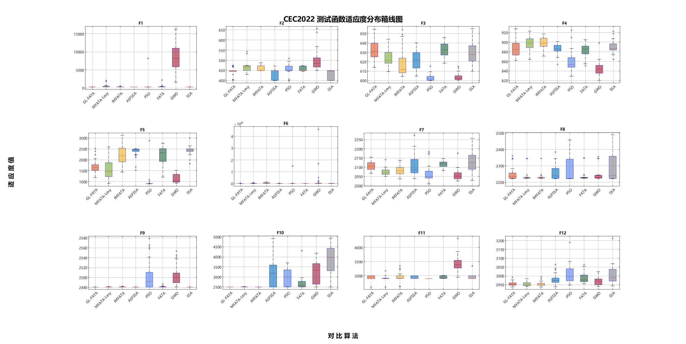
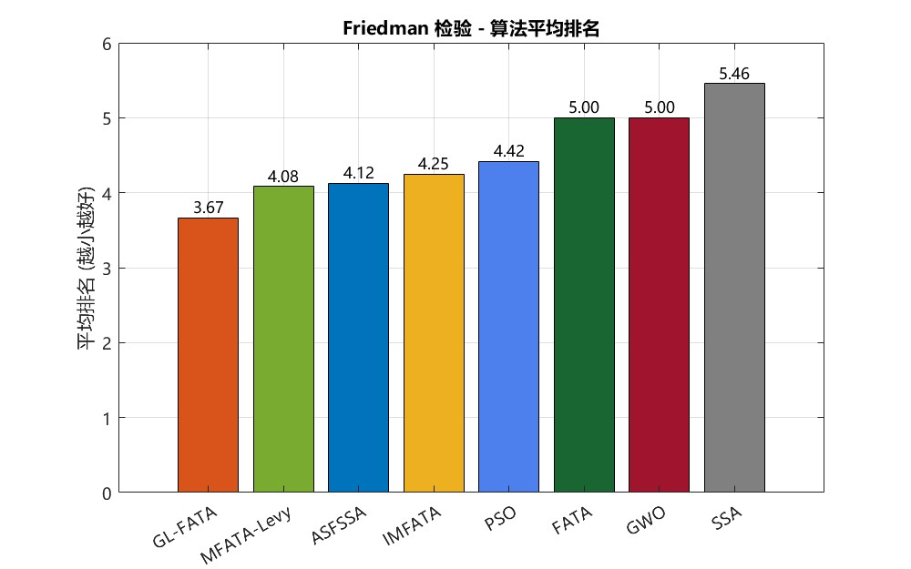
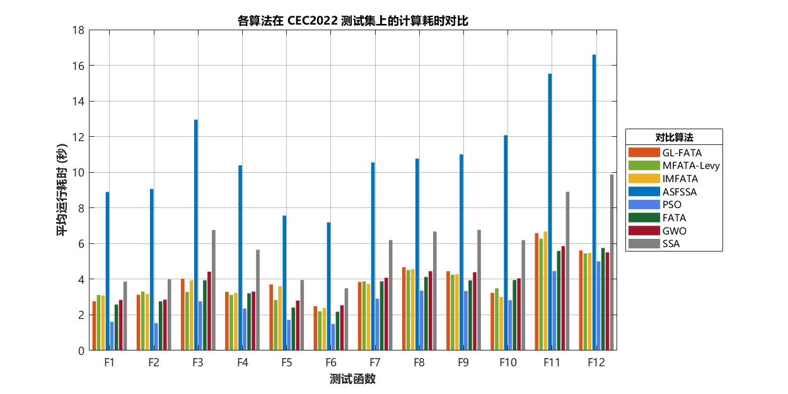
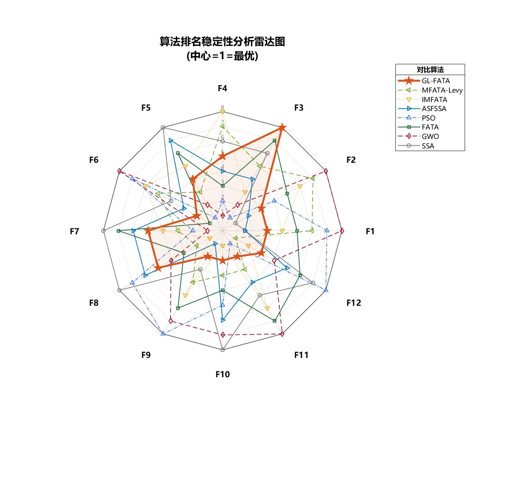

# GL-FATA: Improved Fata Morgana Algorithm for CEC2022 Optimization

[](https://www.mathworks.com/products/matlab.html)
[](LICENSE)
[](https://github.com/aliasgharheidaricom/FATA-An-Efficient-Optimization-Method-Based-on-Geophysics)

GL-FATA 是一个用于连续数值优化的 MATLAB 元启发式优化算法项目。在原始 **FATA（Fata Morgana Algorithm）** 的海市蜃楼滤波与光传播机制上，GL-FATA 加入 PWLCM 混沌初始化、引导因子折射与 Lévy 飞行扰动；仓库同时提供 IEEE CEC2022 对比、消融、统计和制图脚本。

**Keywords:** Fata Morgana Algorithm, FATA, GL-FATA, metaheuristic optimization, swarm intelligence, MATLAB, CEC2022, continuous optimization, Lévy flight, chaotic initialization.

| 项目 | 说明 |
| --- | --- |
| 核心实现 | `GL_FATA.m` |
| 优化类型 | 无梯度、连续、单目标最小化 |
| 基线实现 | FATA（以 Git submodule 固定上游版本） |
| 验证集 | IEEE CEC2022 |
| 基础检查 | `tests/smoke_test.m` |

## 目录

- [快速开始](#快速开始)
- [函数接口](#函数接口)
- [算法组成](#算法组成)
- [结果展示](#结果展示)
- [CEC2022 实验](#cec2022-实验)
- [仓库结构](#仓库结构)
- [上游更新](#上游更新)
- [引用与许可证](#引用与许可证)

## 快速开始

### 获取完整工作副本

首次克隆时初始化上游 FATA：

```bash
git clone --recurse-submodules https://github.com/424635328/GL-FATA.git
cd GL-FATA
```

已有工作副本则执行：

```bash
git submodule update --init --recursive
git submodule status
```

`third_party/FATA` 指向固定的上游提交，用于对照基线来源；本项目的改进实现位于根目录 `GL_FATA.m`。

### 运行基础检查

在仓库根目录打开 MATLAB：

```matlab
run(fullfile('tests', 'smoke_test.m'))
```

该脚本在标量边界与逐维边界下运行 GL-FATA 和 FATA，检查最优值、收敛曲线与边界约束。它不依赖额外工具箱，也不会执行完整的 CEC2022 批量任务。

### 最小调用示例

```matlab
addpath(pwd);
rng(20260722, 'twister');

fobj = @(x) sum(x .^ 2);
lb = -100;
ub = 100;
dim = 30;
populationSize = 30;
maxFEs = 15000;

[bestPos, bestScore, curve] = GL_FATA( ...
    fobj, lb, ub, dim, populationSize, maxFEs);

semilogy(curve, 'LineWidth', 1.5);
xlabel('Iteration');
ylabel('Best fitness');
title('GL-FATA on Sphere');
grid on;
```

## 函数接口

```matlab
[bestPos, bestScore, curve] = GL_FATA(fobj, lb, ub, dim, N, MaxFEs)
```

| 参数 | 含义 |
| --- | --- |
| `fobj` | 目标函数句柄，输入为 `1 × dim` 向量，返回标量适应度。 |
| `lb` / `ub` | 标量边界或长度为 `dim` 的行向量边界。 |
| `dim` | 决策变量维度。 |
| `N` | 种群规模。 |
| `MaxFEs` | 最大函数评估次数。 |
| `bestPos` | 找到的最优位置。 |
| `bestScore` | 对应的最小目标值。 |
| `curve` | 每代最优值组成的收敛曲线。 |

根目录 `FATA.m` 是可直接调用的基线副本，`initialization.m` 提供其初始化依赖。为公平比较，建议让 `MaxFEs` 为 `N` 的整数倍：原始 FATA 以整代评估种群，非整数倍预算可能超过设定值；GL-FATA 已在评估前检查剩余预算。

## 算法组成

| 组件 | 代码位置 | 作用 |
| --- | --- | --- |
| PWLCM 初始化 | `GL_FATA.m` / `initialization_PWLCM` | 使用独立初始种子与预热迭代生成初始种群，降低维度相关性。 |
| 引导因子折射 | 主循环的位置更新阶段 | 最优个体在局部细化，其他个体以 `lambda = 2.0` 的差分引导靠近全局最优。 |
| Lévy 飞行 | 主循环的逃逸策略 | 以 0.2 概率生成有界扰动，只在改进时更新全局最优。 |
| 上游 FATA | `third_party/FATA/` | 保留完整上游工程，便于对照与更新。 |

`GL_FATA.m` 与 `CEC2022/GL_FATA.m` 是同步实现：前者供独立调用，后者使 CEC2022 目录可单独执行。修改算法时应同步两者，再运行冒烟测试和目标实验。

## 结果展示

以下图片来自仓库中保留的 `Run0529` 历史实验快照。排名数值越小越好；结果应结合目标机器、MATLAB 版本、随机流和 MEX 构建环境独立复跑后再作比较。

### 适应度分布

<p align="center">
  
</p>

### 综合排名与运行时间

<table>
  <tr>
    <td width="50%" align="center">
      <strong>Friedman 平均排名</strong><br>
      
    </td>
    <td width="50%" align="center">
      <strong>平均运行时间</strong><br>
      
    </td>
  </tr>
</table>

### 函数级排名轮廓

<p align="center">
  
</p>

## CEC2022 实验

### 依赖与平台

| 项目 | 要求 |
| --- | --- |
| MATLAB | R2016b 或更高版本。 |
| 统计函数 | `ranksum` 和 `tiedrank` 需要 Statistics and Machine Learning Toolbox。 |
| 执行环境 | 按默认脚本执行 `RUNCEC2022_0529.m` 时需要 Parallel Computing Toolbox；该设置仅影响运行耗时，不属于 GL-FATA 的方法组成。 |
| CEC 函数 | 已提供 Windows x64 的 `cec22_func.mexw64`；其他平台需在 `CEC2022` 目录使用受支持的 C++ 编译器编译 `cec22_func.cpp`。 |

### 推荐入口与数据流

```matlab
cd('CEC2022');
RUNCEC2022_0529
Analyze_0529
```

```text
RUNCEC2022_0529.m
        │
        ├── CEC2022_Data.mat       # 每函数、每算法、每次运行的原始记录
        ├── Result_*.xlsx          # 汇总统计、秩和检验、耗时和排名
        └── Analyze_0529.m         # 箱线图、排名图、雷达图、时间图
```

当前推荐配置如下；完整任务的评估次数较高，建议先降低 `run_times` 与 `MaxFEs` 完成环境检查。

| 配置 | 当前值 |
| --- | --- |
| 测试函数 | F1–F12 |
| 维度 | 20 |
| 种群规模 | 30 |
| 独立运行次数 | 30 |
| 最大评估次数 | 300,000 / 次 |
| 对比算法 | GL-FATA、MFATA-Levy、IMFATA、ASFSSA、PSO、FATA、GWO、SSA |

### 运行边界与复现建议

- `RUNCEC2022_0529.m` 会直接读写 `CEC2022_Data.mat` 和 `Result_*.xlsx`；这些文件包含历史快照。请在单独分支、工作副本或备份副本中运行，避免覆盖已有结果。
- 主运行器目前不固定全局随机流。若需要可重复的统计结果，应在运行前明确配置随机流，并记录 MATLAB、工具箱、CPU 和执行环境。
- `runsCEC2022_Main.m`、`runsCEC2022_Main_Parallel.m` 与 `RunCEC2022/` 下的脚本是不同阶段的入口；它们的算法列表和输出格式并不完全相同。新增结果应标明所用入口，不要混合统计。

### 消融实验

```matlab
cd('CEC2022');
Run_Ablation_Study
Analyze_Ablation_Results
```

消融任务比较原始 FATA、去除 PWLCM、去除引导因子、去除 Lévy 飞行和完整 GL-FATA 五种变体，结果保存为 `Ablation_Experiment_Results.mat`。

## 仓库结构

```text
GL-FATA/
├── GL_FATA.m                    # 独立调用的 GL-FATA 主实现
├── FATA.m                       # 可运行的 FATA 基线副本
├── initialization.m             # 基线初始化依赖
├── CLAUDE.md                     # Claude Code 项目入口与协作约定
├── .claude/
│   ├── knowledge/                # 算法、实验、结果与结构知识库
│   └── skills/                   # 核心维护、CEC2022、结果展示专属技能
├── tests/
│   └── smoke_test.m             # 无工具箱基础检查
├── third_party/
│   └── FATA/                    # 固定版本的上游 FATA 子模块
└── CEC2022/
    ├── RUNCEC2022_0529.m        # 推荐的对比实验入口
    ├── Analyze_0529.m           # 统计、导出与制图
    ├── Run_Ablation_Study.m     # 消融实验
    ├── GL_FATA.m                # CEC2022 目录的同步实现
    ├── cec22_func.cpp/.mexw64   # CEC2022 测试函数
    ├── input_data22/            # CEC2022 基准数据
    └── RunCEC2022/              # 历史运行快照与图表
```

## 上游更新

子模块默认锁定到已验证的提交。评估新上游版本时，在独立分支执行：

```bash
git submodule update --remote third_party/FATA
git diff --submodule=log
```

确认兼容性、许可证和实验影响后，再提交更新后的子模块指针。

## 引用与许可证

使用原始 FATA 或本项目基线比较时，请引用原论文：

```bibtex
@article{qi2024fata,
  title   = {FATA: An Efficient Optimization Method Based on Geophysics},
  author  = {Qi, Ailiang and Zhao, Dong and Heidari, Ali Asghar and Liu, Lei and Chen, Yi and Chen, Huiling},
  journal = {Neurocomputing},
  volume  = {607},
  pages   = {128289},
  year    = {2024},
  doi     = {10.1016/j.neucom.2024.128289}
}
```

本项目采用 [MIT License](LICENSE)。`third_party/FATA` 是独立子模块，保留其上游 [MIT License](third_party/FATA/LICENSE) 与作者署名；再分发时请同时遵守两者的许可证与引用要求。
